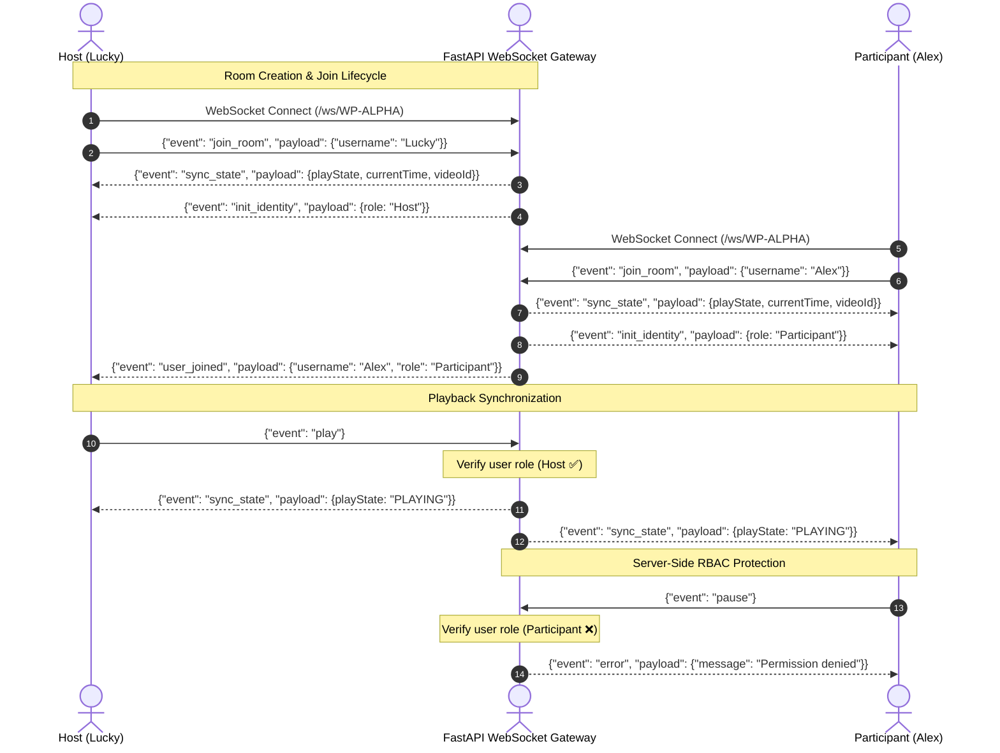

# 🎬 Real-Time Collaborative YouTube Watch Party & RBAC Engine

[](https://fastapi.tiangolo.com)
[](https://react.dev)
[](https://developer.mozilla.org/en-US/docs/Web/API/WebSockets_API)
[](#-automated-testing)
[](LICENSE)

A high-performance, real-time synchronized video streaming room built with **FastAPI WebSockets**, **React 19**, and a **server-enforced Role-Based Access Control (RBAC)** engine with sub-millisecond dynamic drift compensation.

---

## 🌟 Key Architecture Highlights

1. **Server-Side RBAC Enforcement**:
   - Security permissions are enforced **on the server**, not just hidden in the frontend.
   - Unauthorized WebSocket packets (e.g., a Participant attempting to emit `play`, `pause`, `seek`, or `change_video`) are rejected with `PERMISSION_DENIED` errors.
2. **Dynamic Mathematical Drift Compensation**:
   - Zero-polling design. The server tracks `last_seek_time` and `last_updated_at`.
   - Elapsed playback time is calculated dynamically:
     $$\text{Current Time} = T_{\text{last\_seek}} + (\text{now}() - T_{\text{updated}})$$
   - Smart client-side threshold: drift $< 1.0\text{s}$ avoids jittery micro-seeking; drift $> 1.2\text{s}$ executes smooth alignment.
3. **Clean Object-Oriented Architecture (OOP)**:
   - Structured backend: `RoomManager`, `Room`, `Participant`, `PlayState`, and `Role` classes with type annotations.
4. **Rich Social Experience**:
   - Real-time room chat, floating emoji reaction particles, invite link generator, and instant Host migration if the room creator disconnects.

---

## 🏗️ System Architecture & Event Flow



---

## 🛡️ Role-Based Access Control (RBAC) Matrix

| Action | Host 👑 | Moderator 🛡️ | Participant 👤 | Server Verification |
| :--- | :---: | :---: | :---: | :--- |
| **Play / Pause / Resume** | ✅ | ✅ | ❌ | Server rejects unprivileged attempts with `403` error |
| **Timeline Seek** | ✅ | ✅ | ❌ | Server updates reference timestamp only for Host/Mod |
| **Change Video ID** | ✅ | ✅ | ❌ | Server validates YouTube video ID and resets offset |
| **Promote to Moderator** | ✅ | ❌ | ❌ | Host-only privilege; broadcasts `role_assigned` |
| **Remove / Kick User** | ✅ | ❌ | ❌ | Disconnects socket and notifies target member |
| **Live Chat & Reactions** | ✅ | ✅ | ✅ | Open to all room participants |
| **Auto-Host Migration** | ✅ | 🔄 | 🔄 | If Host disconnects, highest-rank member is promoted |

---

## 📡 WebSocket Event Specification

### Incoming Client Events
- `join_room` $\rightarrow$ `{ "username": "string" }`
- `play` $\rightarrow$ `{}`
- `pause` $\rightarrow$ `{}`
- `seek` $\rightarrow$ `{ "time": float }`
- `change_video` $\rightarrow$ `{ "videoId": "string" }`
- `assign_role` $\rightarrow$ `{ "userId": "string", "role": "Moderator" | "Participant" }`
- `remove_participant` $\rightarrow$ `{ "userId": "string" }`
- `get_sync` $\rightarrow$ `{}` (Explicit time alignment request)
- `chat_message` $\rightarrow$ `{ "message": "string" }`

### Outgoing Server Events
- `sync_state` $\rightarrow$ `{ "playState": "PLAYING" | "PAUSED", "currentTime": float, "videoId": "string" }`
- `init_identity` $\rightarrow$ `{ "userId": "string", "username": "string", "role": "Host" | "Moderator" | "Participant" }`
- `user_joined` $\rightarrow$ `{ "userId": "string", "username": "string", "role": "string", "participants": [...] }`
- `user_left` $\rightarrow$ `{ "userId": "string", "username": "string", "participants": [...] }`
- `role_assigned` $\rightarrow$ `{ "userId": "string", "username": "string", "role": "string", "participants": [...] }`
- `participant_removed` $\rightarrow$ `{ "userId": "string", "reason": "string" }`
- `chat_message` $\rightarrow$ `{ "userId": "string", "username": "string", "role": "string", "message": "string" }`
- `error` $\rightarrow$ `{ "message": "string" }`

---

## 🚀 Quickstart & Local Setup

### Prerequisites
- Python 3.10+
- Node.js 18+ & npm

### 1. Start Backend Server
```bash
cd backend
python -m pip install -r requirements.txt
python main.py
```
> Server runs on `http://127.0.0.1:8000` (WebSocket gateway: `ws://127.0.0.1:8000/ws/{roomId}`).

### 2. Start Frontend Client
```bash
cd frontend
npm install
npm run dev
```
> Client launches on `http://localhost:5173`.

---

## 🧪 Automated Testing

The backend includes a comprehensive unit verification test covering all RBAC permissions, role transitions, drift mathematics, and socket disconnects:

```bash
cd backend
python test_logic.py
```

### Test Results
```text
[TEST] Starting WatchParty Backend Logic & RBAC Tests...

[PASS] Test 1: First joiner automatically assigned 'Host' role.
[PASS] Test 2: Second joiner assigned 'Participant' role.
[PASS] Test 3: RBAC blocked unauthorized Participant from altering playback.
[PASS] Test 4: Host successfully promoted Participant to 'Moderator'.
[PASS] Test 5: Moderator successfully toggled playback to 'PLAYING'.
[PASS] Test 6: Dynamic time drift correctly computed: 0.5s elapsed.
[PASS] Test 7: Host successfully removed participant.

[SUCCESS] ALL 7 CORE BACKEND & RBAC SPECIFICATIONS PASSED WITH 100% ACCURACY!
```

---

## 🌐 Production Deployment

### Backend (Render / Railway / Fly.io)
- **Runtime**: Python 3.10+
- **Build Command**: `pip install -r requirements.txt`
- **Start Command**: `uvicorn main:app --host 0.0.0.0 --port $PORT`

### Frontend (Vercel / Netlify)
- **Framework**: Vite
- **Build Command**: `npm run build`
- **Output Directory**: `dist`
- **Environment Variables**:
  - `VITE_WS_URL`: `wss://your-backend-service.onrender.com`

---

## 📈 Scalability Roadmap (100k+ Concurrent Rooms)

To transition from single-node in-memory to planetary scale:
1. **Horizontal WebSocket Scaling**:
   - Multiple FastAPI worker pods behind AWS ALB / Cloudflare with Sticky Sessions.
2. **Distributed Redis Pub/Sub**:
   - Integrate `aioredis` pub/sub layer. When Host emits on Node A, Redis broadcasts to Nodes B, C, and D holding connected participants.
3. **State Snapshots**:
   - Write snapshot checkpoints to Redis / DynamoDB every 30s to allow zero-downtime rolling deploys.
